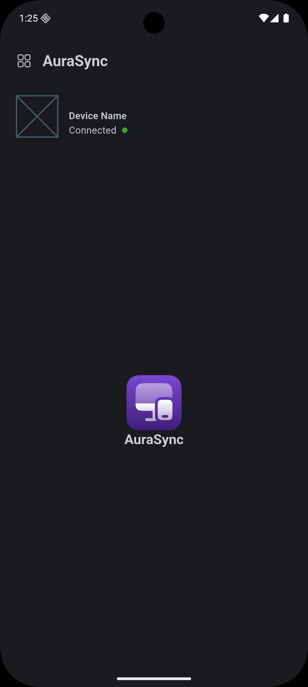
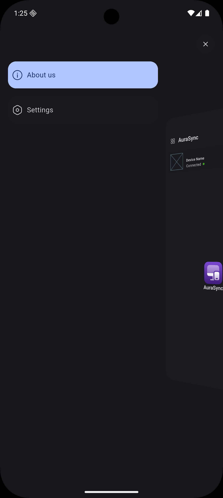

# AuraSync | Mobile

AuraSync connects your Android to your PC or Mac for remote control, mirroring
and real-time data exchange via USB or local network.

## 🧰 Features

Coming soon...

## 🧑‍💻 Technologies

)
)

* [Dart(>=3.8.1)](https://dart.dev/)
* [Flutter(>=3.32.1)](https://flutter.dev/)

## 🖥️ Platforms

* Android(>=5.1|SDK22) ✅

## 📷 Screenshots

<table>
<tr>
  <td></td>
  <td></td>
</tr>
</table>

## 📜 Credits

* SoftYes TI [\<softyes.com.br\>](https://softyes.com.br)
* João Sereia [\<joao.sereia@softyes.com.br\>](mailto:joao.sereia@softyes.com.br)
